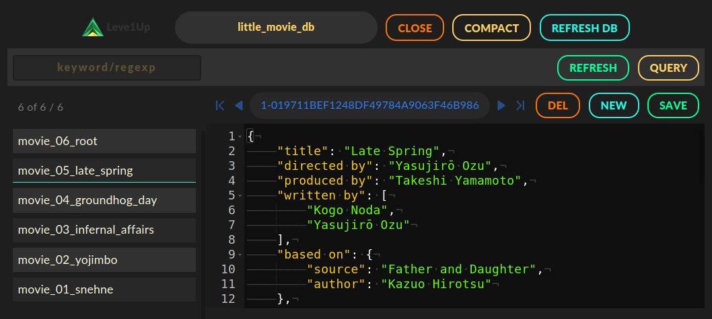

# []() Leve1Up

## [ discontinued ]
This repo is not likely to get any more commitments.

# docker
how to build and run the docker image
```bash
docker build -t level1up .
```

then execute and mount the db folder
```bash
docker run --rm -it -p 1234:1234 -v path-to-db:/db level1up
```

## Leve1Up
**A Graphical User Interface for NoSQL ( CouchDB, LevelDB ) database management**

* Shows up in Modern Browsers (doesn't need atom-shell, etc.)
* Developed on top of NodeJs, ExpressJs, PouchDB ...

### Getting Started
Make sure NodeJs and NPM are installed (Requirements .)   
Download this repository (git) and install it with dependencies (npm .)     
*These steps depend on your OS. Debian  e.g.*   
```
$ git clone https://github.com/mhgolkar/Leve1Up.git ~/Leve1Up
$ cd ~/Leve1Up
$ npm install
```
Now you can run it as a NodeJS app (Debian e.g.):
```
$ node ./main.js
```
or perhaps `$ node ~/Leve1Up/main.js` from any other working directory.


That's it all.   
The Leve1Up server side will run ( by default on `http://localhost:1234` ) and salutes you in the terminal.   
*Open the given address in your browser to use it.*  
To change host, port  or any other settings, you can edit `configs.js` file.  

[](#)

[](#)
      
      
#### Notes
* you can **turn off the server side** by sending any request to a path specified in `configs.js` ( by default browsing `http://localhost:1234/turn-off` does the job.)  
* There is a very small **sample LevelDB database** in `./little_movie_db` shipped with the repository, which can be used locally to discover what Leve1Up can do.   
* If the port `1234` is being used by another app or service, you'll get an error. Simply change the port as mentioned.  
* It's generally safer to use absolute path for local dbs. A relative path is normally relative to the current working directory (the directory from which you invoked the node command).

Have a nice time .
